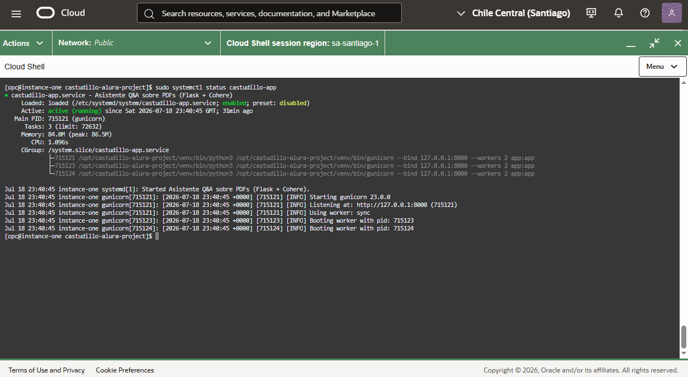

# Asistente Q&A sobre PDFs (Cohere)

Aplicación simple en Python: carga PDFs de la carpeta `documents/`, recupera fragmentos relevantes y responde con **Cohere** usando **solo** ese contexto. Interfaz web HTML responsive.

## Requisitos

- Python 3.9+
- API key de [Cohere Dashboard](https://dashboard.cohere.com/api-keys)

## Instalación

**Windows:**

```bash
python -m venv venv
venv\Scripts\activate
pip install -r requirements.txt
copy .env.example .env
```

**Linux/macOS:**

```bash
python3 -m venv venv
source venv/bin/activate
pip install -r requirements.txt
cp .env.example .env
```

Edita `.env` y pon tu `COHERE_API_KEY`.

## Uso

1. Copia tus archivos `.pdf` en la carpeta `documents/`.
2. Inicia el servidor:

```bash
python app.py
```

3. Abre en el navegador: `http://127.0.0.1:5000`

Si añades PDFs con el servidor en marcha, reinicia la app o llama a `POST /api/reload` para volver a indexar.

Para producción, usa `gunicorn` en vez del servidor de desarrollo de Flask (ver `deploy/app.service`):

```bash
gunicorn --bind 0.0.0.0:8000 --workers 2 app:app
```

## Despliegue

La app está desplegada en una instancia de **Oracle Cloud Infrastructure (OCI)**, corriendo como servicio `systemd` detrás de un proxy inverso **nginx** con certificado **SSL autofirmado**.

Acceso: `https://129.151.126.75` (el navegador mostrará una advertencia de certificado no confiable por ser autofirmado; puedes continuar de forma segura).

Estado del servicio en el servidor (`sudo systemctl status castudillo-app`):



## Estructura

| Archivo | Rol |
|---------|-----|
| `app.py` | Servidor Flask y rutas |
| `pdf_loader.py` | Extracción de texto con PyPDF |
| `rag.py` | Troceado y búsqueda de fragmentos |
| `cohere_client.py` | Llamada a Cohere con instrucciones estrictas |
| `templates/index.html` | Chat responsive |
| `requirements.txt` | Dependencias Python (Flask, pypdf, cohere, gunicorn, etc.) |
| `.env.example` | Plantilla de variables de entorno (`COHERE_API_KEY`, `COHERE_MODEL`, `PORT`) |
| `deploy/app.service` | Unidad systemd para correr la app con gunicorn como servicio |
| `deploy/nginx.conf` | Proxy inverso nginx con SSL para el despliegue en OCI |
| `docs/` | Capturas y material de referencia del despliegue |

## Notas

- Las respuestas están limitadas al texto extraíble de los PDF (escaneos sin OCR pueden quedar vacíos).
- Para muchos documentos largos, conviene afinar `TOP_K` y tamaños de chunk en `rag.py`.
- Si despliegas en Oracle Linux con SELinux activo, evita crear el proyecto o el venv dentro de `/home/<usuario>/` para el servicio systemd (SELinux bloquea la lectura de `EnvironmentFile` ahí); usa `/opt/` en su lugar. Tampoco muevas un venv ya creado a otra ruta (los scripts de `venv/bin/` quedan con rutas rotas) — recréalo con `python3 -m venv venv` en la ubicación final.
